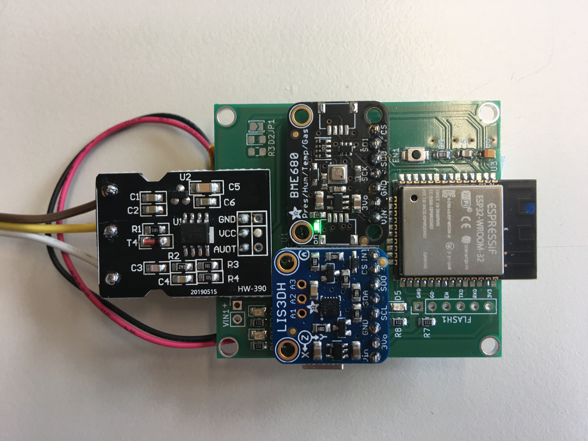
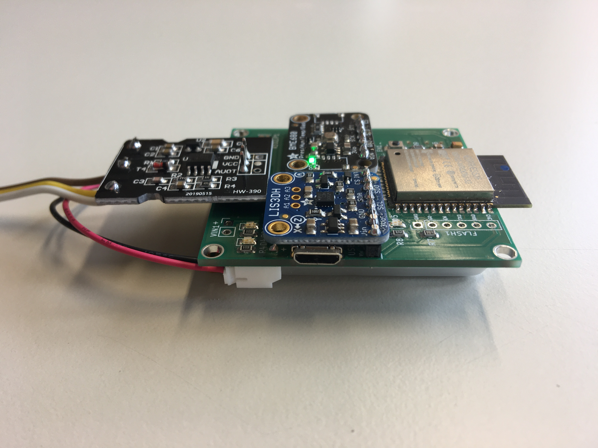
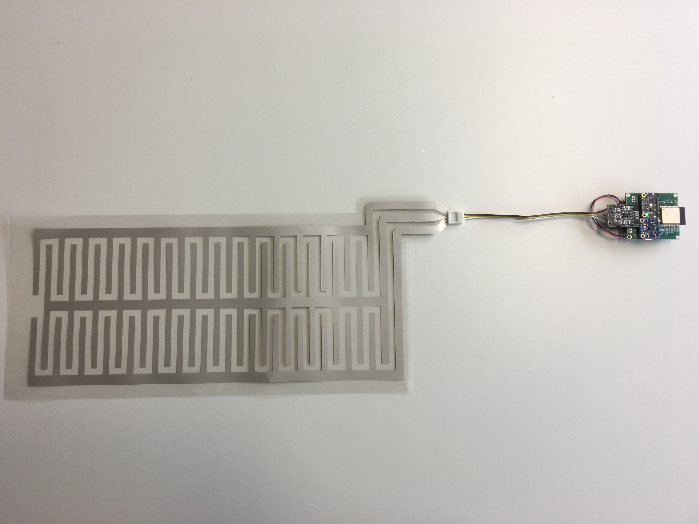
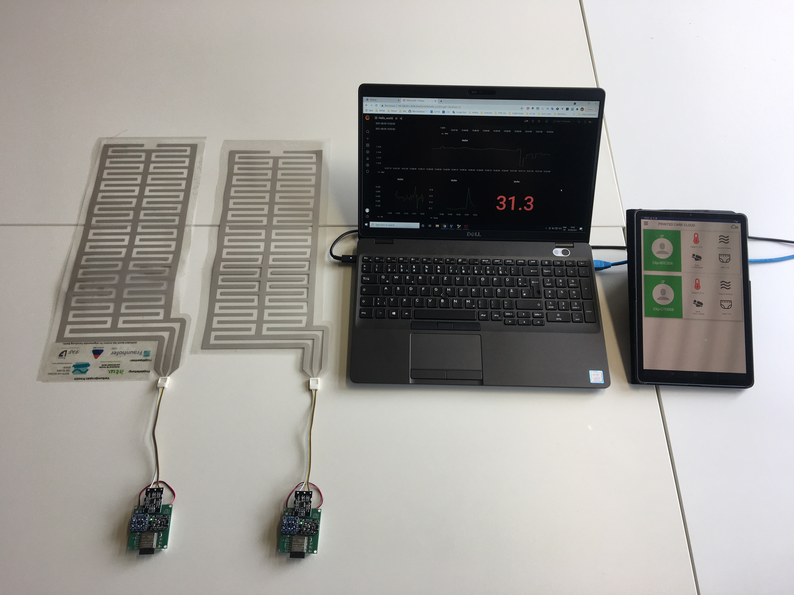

# PrintED

Readout device hardware for PrintED project

- Readout Device

Front                              |  Edge
:---------------------------------:|:--------------------------------------:
  | 

- Readout Device with PrintED Sensor

- System Deployment

## Compatibility

- [beuth-printed-sensor-fw](https://github.com/pdt590/beuth-printed-sensor-fw)
- [beuth-printed-app](https://github.com/pdt590/beuth-printed-app)
- [beuth-printed-cloud](https://github.com/pdt590/beuth-printed-cloud)
